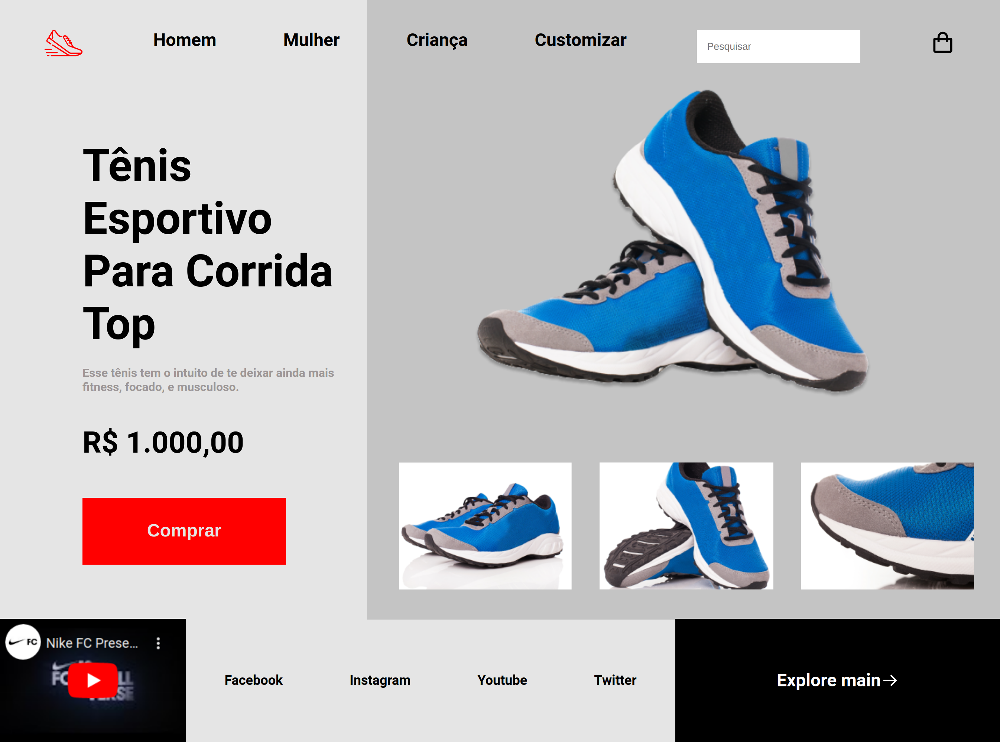
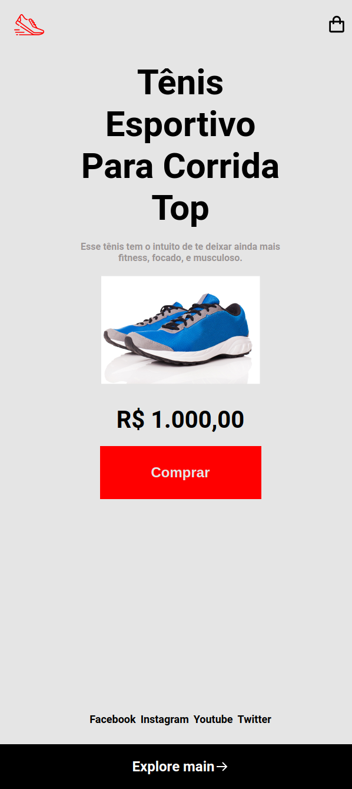

<h1 align="center">
    Desafio: RocketShoes
</h1>

<p align="center">
 <a href="#-sobre-o-projeto">Sobre</a> •
 <a href="#-layout">Layout</a> •
<a href="#-tecnologias">Tecnologias</a> •
<a href="#-autor">Autor</a> •

</p>

## 💻 Sobre o projeto

Neste desafio criamos uma página, um mini e-commerce de calçados esportivos.

---

## 🎨 Layout

O layout da aplicação:

<p align="center" style="display: flex; align-items: flex-start; justify-content: center;">
  

</p>
<p align="center" style="display: flex; align-items: flex-start; justify-content: center;">
  

</p>
<p align="center" style="display: flex; align-items: flex-start; justify-content: center;">
  

</p>

---

## 🚀 Como executar o projeto

Este projeto é divido em uma parte:

1 . Frontend

### Pré-requisitos

Antes de começar, você vai precisar ter instalado em sua máquina as seguintes ferramentas:
[Git](https://git-scm.com).
Além disto é bom ter um editor para trabalhar com o código como [VSCode](https://code.visualstudio.com/)

#### 🎲 Rodando o Frontend

```bash

# Clone este repositório
$ git clone https://github.com/brunogoncalvesferreira/rocketshoes.git

# Acesse a pasta do projeto no terminal/cmd
$ cd rocketshoes

# Execute a aplicação
$ Instale a extensão LiveServer no VSCode.
$ Botão direito do mouse no arquivo index.html, clicar em liverserver. Irá abrir no seu navegador a aplicação.


```

---

## 🛠 Tecnologias

As seguintes ferramentas foram usadas na construção do projeto:

- [HTML](https://developer.mozilla.org/pt-BR/docs/Web/HTML)
- [CSS](https://developer.mozilla.org/pt-BR/docs/Web/CSS)

---

## 🦸 Autor

<a href="https://github.com/brunogoncalvesferreira"><br /><sub><b>Bruno Gonçalves</b></sub></a></a>
<br />

[](https://twitter.com/BrunoGoferreir) [](https://www.linkedin.com/in/bruno-goncalves-ferreira/)
[](mailto:brunogonferreira@gmail.com)
